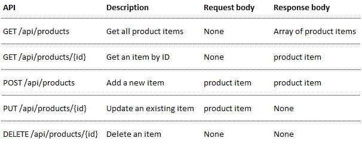

# RESTful Web Services com ASP.NET Core
Tutorial demonstrando como implementar uma RESTful Web API com **ASP.NET Core**.

Recentemente nos últimos anos, está cada vez mais claro que HTTP não é apenas para servir páginas [HTML](https://www.w3.org/TR/html52/). É também uma poderosa plataforma para construir **Web APIs**, que expõem serviços e dados, através da utilização de diversos métodos HTTP (GET, POST, DELETE, etc) além de conceitos simples como URIs e headers. [ASP.NET Web API](https://docs.microsoft.com/en-us/aspnet/web-api/) possui um conjunto de componentes que simplificam a programação HTTP.

**REST (Representational State Transfer)** é um modelo de arquitetura que foi especificado por Roy Fielding, um dos principais criadores do protocolo HTTP em sua tese de doutorado, e foi adotado como o modelo de arquitetura a ser utilizado na evolução do protocolo HTTP.  Consiste em princípios, padões e constraints que, quando implementadas, permitem a criação de um projeto com interfaces bem definidas.

O modelo proposto por Fielding permitiu uma forma muito simples e mais coesa, dando sentido às requisições HTTP, conforme exemplos:

* GET http://www.mydomain.com/users
* POST http://www.mydomain.com/users/{name:jonh}
* DELETE http://www.mydomain.com/users/{id}

Logo a comunidade percebeu que o modelo de arquitetura REST poderia ser utilizado na implementação de Web Services, com o objetivo de se integrar aplicações pela Web, e passaram a utilizá-lo como uma alternativa ao [SOAP](https://www.w3.org/TR/2000/NOTE-SOAP-20000508/).

**RESTful** é quando um determinado projeto implementa os princípios/padrÕes do REST.

[ASP.NET Web API](https://docs.microsoft.com/en-us/aspnet/web-api/) é uma framework para construir Web APIs. Neste tutorial iremos construir uma aplicação RESTful para um Cadastro de Produtos (CRUD), utilizando ASP.NET Web API. Vamos demonstrar também os princípios na implementação de uma aplicação RESTful.

## Pré-Requisitos

1. Instalar o [Visual Studio 2017](https://www.visualstudio.com/downloads/) – Pode ser o community 

## Princípios de uma aplicação RESTful

A seguir vamos apresentar os princípios do RESTful e como utilizá-los de maneira correta na sua aplicação.

### Identificação dos Recursos

Toda aplicação gerencia algumas informações. Uma aplicação de um E-commerce, por exemplo, gerencia seus produtos, clientes, vendas, etc. Essas coisas que uma aplicação gerencia são chamadas de Recursos no modelo REST.

Um recurso em uma aplicação REST é uma abstração sobre um determinado tipo de informação que uma aplicação gerencia. Entretanto, um dos princípios do REST consiste que todo recurso deve possuir um identificador único.

Sendo assim, faz-se necessário a identificação do recurso através do conceito de URI (Uniform Resource Identifier). Seguem alguns exemplos de URI's:

```html
http://apirest.com/products;
http://apirest.com/customers;
http://apirest.com/customers/01;
http://apirest.com/sales.
```

As URI’s representam a interface dos seus serviços, definindo um contrato que será utilizado pelos clientes para acessá-los. Vejamos  algumas boas práticas na definição de URI’s:

* **Utilize URI's legíveis**
* **Evite incluir na URI a operação a ser realizada no recurso.** Utilize os métodos HTTP para manipulação dos recursos conforme quadro abaixo:
  
  

* **Defina um padrão de URI na identificação dos recursos**

  

* **Evite incluir na URI o formato desejado da representação do recurso.**
```http://apirest.com/products/xml```
```http://apirest.com/customers/10?formato=json```

### Representação dos Recursos

Os recursos são armazenados pela aplicação que os manipula. Quando são solicitados pelas aplicações clientes, por exemplo em uma solicitação do tipo GET, é transferido para a aplicação cliente uma representação do recurso.

Um recurso pode ser representado através de diversos formatos, tais como ```XML```, ```JSON```, ```HTML```, ```CSV```, entre outros. Abaixo é demonstrado um exemplo de representação de um recurso no formato ```XML```:

```XML
<customer>
  <name>Jonh</name>
  <email>jonh@email.com</email>
  <sexo>Masculino</sexo>
  <address>
    <city>Orlando</cidade>
    <zip_code>44492</zip_code>
  </address>
</customer>
```
 
O cliente sempre utiliza a representação do recurso para efetuar a comunicação com o cliente. Portanto, é um princípio de uma aplicação RESTful, prover o suporte a **múltiplas representações** em um serviço REST. Ao suportar apenas um tipo de formato, um serviço REST limita seus clientes, a utilizar uma única reprsentação disponível. É **recomendável** por boa prática prover representações para os **três principais formatos**:
* HTML
* XML
* JSON

### Utilize Content Negotiation para o suporte de múltiplas representações

Como vimos no item anterior um serviço REST pode suportar múltiplas representações de recursos. Portanto, nesses casos é esperado que o cliente forneça o formato desejado a ser utilizado. No REST esta negociação é chamada de **Content Negotiation** e na solicitação Web é feita através de um cabeçalho HTTP definido como ```accept```.

O cliente pode portanto, incluir no cabeçalho **accept** da solicitação o formato desejado da representação do recurso. Entretanto, deve ser um formato suportado pelo serviço REST.

### Mantenha um relacionamento Stateless o desenvolvimento dos Serviços REST

O protocolo HTTP é um protocolo que não guarda estado de conversação, ou seja, é um protocolo **stateless**, cada solicitação e resposta feita ao servidor HTTP são independentes de todas as outras. Portanto, este é um dos princípios mais difíceis de ser implementado, pois  é comum que aplicações mantenham estado entre as várias solicitações de clientes.

Manter uma comunicação stateless é importante, pois ganha-se em escalabilidade e alta performance, podendo com isto atender um número alto de clientes sem problemas.

Solicitações feitas por um cliente a um serviço REST devem conter todas as informações necessárias para que o servidor as processe corretamente. Clientes **não devem** depender de dados **previamente armazenados** no servidor para processar uma requisição. Qualquer informação de estado deve ser mantida pelo cliente e não pelo servidor.

### Evite manter dados de autenticação/autorização em sessão

Uma das principais dificuldades de se criar um serviço REST totalmente Stateless ocorre quando **há necessidade de prover autenticação/autorização de clientes**. O principal problema ocorre por que é natural que os desenvolvedores armazenem essas informações em sessão, pois essa solução é comum ao se desenvolver uma aplicação Web tradicional.

Para solucionar o problema **é necessário a utilização de Tokens de acesso**, que são gerados pelo serviço REST e devem ser armazenados pelos clientes, via **cookies** ou **HTML5 Web Storage**, devendo também serem enviados pelos clientes a cada nova solicitação ao serviço.

Existem **diversas tecnologias** e padrões para se trabalhar com Tokens, entre as principais:

* [OAUTH](https://oauth.net/2/)
* [JWT (JSON Web Token)](https://jwt.io/introduction/)
* [Keycloack](https://www.keycloak.org/index.html)

Portanto, evite a utilização de objetos session em aplicações REST. O ideal é que sua aplicação seja **totalmente Stateless**.

### HATEOAS (Hypermedia As The Engine Of Application State)

Este conceito é muito aplicado no desenvolvimento de aplicações Web. Consiste em um mecanismo para orientar conduzir o cliente quanto à navegação e ao estado dos recursos. [HATEOAS](https://restfulapi.net/hateoas/), nada mais é do que a utilização de Hypermedia, com o uso de links, como o motor para guiar os clientes quanto ao estado atual dos recursos, e também quanto as transições de estado que são possíveis no momento.

Veja um exemplo de uma representação de um recurso **sem a utilização** do conceito de **HATEOAS**:

```html
<order>
  <id>1870</id>
  <date>2018-05-15</date>
  <status>OPEN</status>
  <customer>
    <name>Jonh</name>
  </customer>
</order>
```

A representação do recurso sem a utilização de HATEOAS, pode gerar dúvidas como:

* É possível solicitar o cancelamento do pedido? Como solicito?
* Como obter mais informações sobre o cliente desse pedido?
* Quais são os outros estados do pedido e como transitar entre eles?

As dúvidas acima poderiam ser respondidas se o conceito HATEOAS fosse aplicado, facilitando assim o entendimento dos clientes do serviço REST. Vejamos agora a representação **utilizando o conceito** HATEOAS:

```html
<order self="http://servicorest.com.br/pedidos/1459">
  <id>1870</id>
  <date>2018-05-15</data>
  <status>OPEN</status>
  <customer ref="http://apirest.com/customers/780" />
  <actions>
    <action>
      <rel>self</rel>
      <uri>http://apirest.com/orders/1870</uri>
      <method>GET</method>
    </action>
    <action>
      <rel>cancelar</rel>
      <uri>http://apirest.com/orders/1870</uri>
      <method>DELETE</method>
    </action>
  </actions>
</order>
```

Observe que agora ficou mais simples explorar as informações e descobrir quais caminhos seguir. **HATEOAS** é um dos princípios pouco implementado no desenvolvimento de serviços REST no mercado, quase sempre por falta de conhecimento dos desenvolvedores.

### Utilização correta dos códigos HTTP

Esta na verdade é uma boa prática e não um princípio. Consiste na **utilização correta** do código HTTP para cada tipo de situação. Evite sempre **utilizar um mesmo código genérico** para todas as situações, como por exemplo o código **200** para solicitações bem-sucedidas ou o código **500** para solicitações malsucedidas. Vejamos abaixo os principais códigos HTTP e quando os utilizá-los:


## Criando uma aplicação Web API com ASP.NET Core

Agora que já vimos os **principais princípios** de uma aplicação REST, vamos iniciar o nosso projeto POC. Como já dito nós vamos construir uma aplicação RESTful para um **Cadastro de Produtos (CRUD)**. O quadro abaixo demonstra a API que desenvolveremos neste tutorial:



O diagrama demonstra o desenho basico da aplicação


