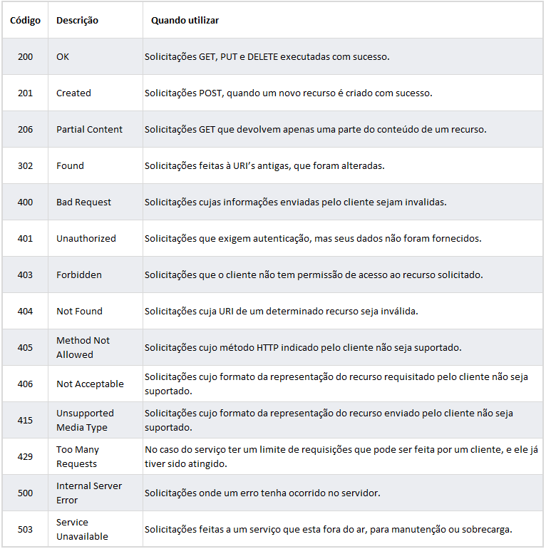

# RESTful Web Services com ASP.NET Core
Tutorial demonstrando como implementar uma RESTful Web API com **ASP.NET Core**.

Recentemente nos últimos anos, está cada vez mais claro que HTTP não é apenas para servir páginas [HTML](https://www.w3.org/TR/html52/). É também uma poderosa plataforma para construir **Web APIs**, que expõem serviços e dados, através da utilização de diversos métodos HTTP (GET, POST, DELETE, etc) além de conceitos simples como URIs e headers. [ASP.NET Web API](https://docs.microsoft.com/en-us/aspnet/web-api/) possui um conjunto de componentes que simplificam a programação HTTP.

**REST (Representational State Transfer)** é um modelo de arquitetura que foi especificado por Roy Fielding, um dos principais criadores do protocolo HTTP em sua tese de doutorado, e foi adotado como o modelo de arquitetura a ser utilizado na evolução do protocolo HTTP.  Consiste em princípios, padões e constraints que, quando implementadas, permitem a criação de um projeto com interfaces bem definidas.

O modelo proposto por Fielding permitiu uma forma muito simples e mais coesa, dando sentido às requisições HTTP, conforme exemplos:

* GET http://www.mydomain.com/users
* POST http://www.mydomain.com/users/{name:jonh}
* DELETE http://www.mydomain.com/users/{id}

Logo a comunidade percebeu que o modelo de arquitetura REST poderia ser utilizado na implementação de Web Services, com o objetivo de se integrar aplicações pela Web, e passaram a utilizá-lo como uma alternativa ao [SOAP](https://www.w3.org/TR/2000/NOTE-SOAP-20000508/).

**RESTful** é quando um determinado projeto implementa os princípios/padrÕes do REST.

[ASP.NET Web API](https://docs.microsoft.com/en-us/aspnet/web-api/) é uma framework para construir Web APIs. Neste tutorial iremos construir uma aplicação RESTful para um Cadastro de Produtos (CRUD), utilizando ASP.NET Web API. Vamos demonstrar também os princípios na implementação de uma aplicação RESTful.

## Princípios de uma aplicação RESTful

A seguir vamos apresentar os princípios do RESTful e como utilizá-los de maneira correta na sua aplicação.

### Identificação dos Recursos

Toda aplicação gerencia algumas informações. Uma aplicação de um E-commerce, por exemplo, gerencia seus produtos, clientes, vendas, etc. Essas coisas que uma aplicação gerencia são chamadas de Recursos no modelo REST.

Um recurso em uma aplicação REST é uma abstração sobre um determinado tipo de informação que uma aplicação gerencia. Entretanto, um dos princípios do REST consiste que todo recurso deve possuir um identificador único.

Sendo assim, faz-se necessário a identificação do recurso através do conceito de URI (Uniform Resource Identifier). Seguem alguns exemplos de URI's:

```html
http://apirest.com/products;
http://apirest.com/customers;
http://apirest.com/customers/01;
http://apirest.com/sales.
```

As URI’s representam a interface dos seus serviços, definindo um contrato que será utilizado pelos clientes para acessá-los. Vejamos  algumas boas práticas na definição de URI’s:

* **Utilize URI's legíveis**
* **Evite incluir na URI a operação a ser realizada no recurso.** Utilize os métodos HTTP para manipulação dos recursos conforme quadro abaixo:
  
  

* **Defina um padrão de URI na identificação dos recursos**

  

* **Evite incluir na URI o formato desejado da representação do recurso.**
```http://apirest.com/products/xml```
```http://apirest.com/customers/10?formato=json```

### Representação dos Recursos

Os recursos são armazenados pela aplicação que os manipula. Quando são solicitados pelas aplicações clientes, por exemplo em uma solicitação do tipo GET, é transferido para a aplicação cliente uma representação do recurso.

Um recurso pode ser representado através de diversos formatos, tais como ```XML```, ```JSON```, ```HTML```, ```CSV```, entre outros. Abaixo é demonstrado um exemplo de representação de um recurso no formato ```XML```:

```XML
<customer>
  <name>Jonh</name>
  <email>jonh@email.com</email>
  <sexo>Masculino</sexo>
  <address>
    <city>Orlando</cidade>
    <zip_code>44492</zip_code>
  </address>
</customer>
```
 
O cliente sempre utiliza a representação do recurso para efetuar a comunicação com o cliente. Portanto, é um princípio de uma aplicação RESTful, prover o suporte a **múltiplas representações** em um serviço REST. Ao suportar apenas um tipo de formato, um serviço REST limita seus clientes, a utilizar uma única reprsentação disponível. É **recomendável** por boa prática prover representações pelo menos para os **dois principais formatos**:
* JSON
* XML

### Utilize Content Negotiation para o suporte de múltiplas representações

Como vimos no item anterior um serviço REST pode suportar **múltiplas representações** de recursos. Portanto, nesses casos é esperado que o cliente forneça o formato desejado a ser utilizado. No REST esta negociação é chamada de **Content Negotiation** e na solicitação Web é feita através de um cabeçalho HTTP definido como ```Accept```.

O cliente pode portanto, incluir no cabeçalho **Accept** da solicitação o formato desejado da representação do recurso. Entretanto, deve ser um formato suportado pelo serviço REST.

### Mantenha um relacionamento Stateless o desenvolvimento dos Serviços REST

O protocolo HTTP é um protocolo que não guarda estado de conversação, ou seja, é um protocolo **stateless**, cada solicitação e resposta feita ao servidor HTTP são independentes de todas as outras. Portanto, este é um dos princípios mais difíceis de ser implementado, pois  é comum que aplicações mantenham estado entre as várias solicitações de clientes.

Manter uma comunicação stateless é importante, pois ganha-se em escalabilidade e alta performance, podendo com isto atender um número alto de clientes sem problemas.

Solicitações feitas por um cliente a um serviço REST devem conter todas as informações necessárias para que o servidor as processe corretamente. Clientes **não devem** depender de dados **previamente armazenados** no servidor para processar uma requisição. Qualquer informação de estado deve ser mantida pelo cliente e não pelo servidor.

### Evite manter dados de autenticação/autorização em sessão

Uma das principais dificuldades de se criar um serviço REST totalmente Stateless ocorre quando **há necessidade de prover autenticação/autorização de clientes**. O principal problema ocorre por que é natural que os desenvolvedores armazenem essas informações em sessão, pois essa solução é comum ao se desenvolver uma aplicação Web tradicional.

Para solucionar o problema **é necessário a utilização de Tokens de acesso**, que são gerados pelo serviço REST e devem ser armazenados pelos clientes, via **cookies** ou **HTML5 Web Storage**, devendo também serem enviados pelos clientes a cada nova solicitação ao serviço.

Existem **diversas tecnologias** e padrões para se trabalhar com Tokens, entre as principais:

* [OAUTH](https://oauth.net/2/)
* [JWT (JSON Web Token)](https://jwt.io/introduction/)
* [Keycloack](https://www.keycloak.org/index.html)

Portanto, evite a utilização de objetos session em aplicações REST. O ideal é que sua aplicação seja **totalmente Stateless**.

### HATEOAS (Hypermedia As The Engine Of Application State)

Este conceito é muito aplicado no desenvolvimento de aplicações Web. Consiste em um mecanismo para orientar conduzir o cliente quanto à navegação e ao estado dos recursos. [HATEOAS](https://restfulapi.net/hateoas/), nada mais é do que a utilização de Hypermedia, com o uso de links, como o motor para guiar os clientes quanto ao estado atual dos recursos, e também quanto as transições de estado que são possíveis no momento.

Veja um exemplo de uma representação de um recurso **sem a utilização** do conceito de **HATEOAS**:

```html
<order>
  <id>1870</id>
  <date>2018-05-15</date>
  <status>OPEN</status>
  <customer>
    <name>Jonh</name>
  </customer>
</order>
```

A representação do recurso sem a utilização de HATEOAS, pode gerar dúvidas como:

* É possível solicitar o cancelamento do pedido? Como solicito?
* Como obter mais informações sobre o cliente desse pedido?
* Quais são os outros estados do pedido e como transitar entre eles?

As dúvidas acima poderiam ser respondidas se o conceito HATEOAS fosse aplicado, facilitando assim o entendimento dos clientes do serviço REST. Vejamos agora a representação **utilizando o conceito** HATEOAS:

```html
<order self="http://servicorest.com.br/pedidos/1459">
  <id>1870</id>
  <date>2018-05-15</data>
  <status>OPEN</status>
  <customer ref="http://apirest.com/customers/780" />
  <actions>
    <action>
      <rel>self</rel>
      <uri>http://apirest.com/orders/1870</uri>
      <method>GET</method>
    </action>
    <action>
      <rel>cancelar</rel>
      <uri>http://apirest.com/orders/1870</uri>
      <method>DELETE</method>
    </action>
  </actions>
</order>
```

Observe que agora ficou mais simples explorar as informações e descobrir quais caminhos seguir. **HATEOAS** é um dos princípios pouco implementado no desenvolvimento de serviços REST no mercado, quase sempre por falta de conhecimento dos desenvolvedores.

### Utilização correta dos códigos HTTP

Esta na verdade é uma boa prática e não um princípio. Consiste na **utilização correta** do código HTTP para cada tipo de situação. Evite sempre **utilizar um mesmo código genérico** para todas as situações, como por exemplo o código **200** para solicitações bem-sucedidas ou o código **500** para solicitações malsucedidas. Vejamos abaixo os principais códigos HTTP e quando os utilizá-los:



## Criando uma aplicação Web API com ASP.NET Core

Agora que já vimos os **principais princípios** de uma aplicação REST, vamos iniciar o nosso projeto POC. Como já dito nós vamos construir uma aplicação RESTful para um **Cadastro de Produtos (CRUD)**. O quadro abaixo demonstra a API que desenvolveremos neste tutorial:


O diagrama demonstra o desenho basico da aplicação


* A aplicação cliente que vai consumir a Web API pode ser um (mobile app, browser, etc.). Neste tutorial nós não iremos uma criar uma aplicação cliente. Entretanto, você pode acessar o tutorial que demonstra como consumir uma [Web API REST através de um app Xamarin]().

* O modelo é um objeto que representa os dados na aplicação. Neste caso, o único modelo na nossa aplicação é um produto. Modelos são representados como classes C#, também conhecidas como **Plain Old C# Object (POCOs)**.

* A controller é um objeto que intercepta as solicitações HTTP e cria a resposta HTTP. Nossa aplicação terá uma única controller.

* Para simplificar a camada de persistência, será utilizado o banco de dados em memória.

## Pré-Requisitos

1. Instalar o [Visual Studio](https://www.microsoft.com/net/download/windows) – Pode ser o community 
2. Instalar o {Postman App](https://www.getpostman.com/apps) - Editor de API que permite testar as operações REST
3. Ter conhecimento no desenvolvimento **Web ASP.NET** e **.NET Core cross-platform**

## Criando o projeto

Primeiro, abra o Visual Studio e crie um novo projeto C#. Escolha o template **ASP.NET Core Web Application** e pressione **OK**.


Após, selecione o template **API** e clique em **OK**.


### Executando a aplicação

Tendo o projeto criado você pode pressionar **CTRL+F5** para iniciar a aplicação. O Visual Studio abre o browser padrão e acessa a url ```http://localhost:<port>/api/values```, onde ```<port>``` é escolhida randomicamente. Se tudo estiver correto você verá o seguinte resultado no browser:

```html
["value1","value2"]
```

## Adicionando a Classe Model

Um modelo é um objeto que representa os dados na aplicação. Neste tutorial, teremos somente a classe modelo produto. Na **Solution Explorer**, clique com o botão direito do mouse no projeto e selecione **Add > New Folder**. Defina *Models* para o nome da pasta.

**Observação:** Uma classe modelo pode residir em qualquer lugar no projeto. Por convenção recomenda-se a criação de uma pasta **Models** para inclusão das classes model.

Após, crie a classe modelo clicando com o botão direito na pasta a *Models* e Selecione **Add > New Class**. Defina *Product* para o nome da classe.

Altere a classe ```Product``` com o código definido abaixo:

```C#
namespace ProductAPI.Models
{
    public class Product {
        // Atributos de classe
        private int     productID;
        private String  productCode;
        private String  name;
        private int     quantity;
        private decimal price;

        // Propriedades
        public int     ProductID   { get => productID; set => productID = value; }
        public string  ProductCode { get => productCode; set => productCode = value; }
        public string  Name        { get => name; set => name = value; }
        public int     Quantity    { get => quantity; set => quantity = value; }
        public decimal Price       { get => price; set => price = value; }
    }
}
```

## Criando o Database Context

O database context é a classe main que coordena as operações do [Entity Framework](https://docs.microsoft.com/en-us/ef/) para um dado modelo de dados. A classe deve estender da classe ```Microsoft.EntityFrameworkCore.DbContext```.

Na **Solution Explorer** clique com o botão direito na pasta a *Models* e selecione **Add > New Class**. Defina *ProductContext* para o nome da classe.

Altere a classe ```ProductContext``` com o código definido abaixo:

```C#
using System;
using System.Collections.Generic;
using System.Linq;
using System.Threading.Tasks;
using Microsoft.EntityFrameworkCore;

namespace ProductAPI.Models
{
    public class ProductContext : DbContext {
        // Construtor da classe
        public ProductContext(DbContextOptions<ProductContext> options) : 
            base(options) {
        }

        // Propriedade que retorna o DbSet de Produto
        public DbSet<Product> ProductItems { get; set; }
    }
}
```

## Registrando o Database Context

Neste passo, nós iremos registrar o database context com o container de [injeção de dependência](https://docs.microsoft.com/en-us/aspnet/core/fundamentals/dependency-injection?view=aspnetcore-2.1). Serviços (como DB context) que são registrados com **dependency injection (DI) container** ficam disponíveis para os objetos controller.

Para registrar um DB context é necessário criar uma classe chamada [Startup](https://docs.microsoft.com/en-us/aspnet/core/fundamentals/startup?view=aspnetcore-2.1). Esta classe possui o método ```ConfigureServices``` responsável pela definição de serviços que a aplicação irá usar, incluindo componentes da plataforma como **Entity Framework Core** e **ASP.NET Core MVC**. Este método é invocado em tempo de execução quando a aplicação é iniciada.

Quando você cria o projeto **ASP.NET Core Web Application**, usando o template **API** a classe a classe ```Startup``` é criada automáticamente. Altere o código da classe conforme definido abaixo:

```C#
using Microsoft.AspNetCore.Builder;
using Microsoft.AspNetCore.Hosting;
using Microsoft.EntityFrameworkCore;
using Microsoft.Extensions.Configuration;
using Microsoft.Extensions.DependencyInjection;
using ProductAPI.Models;

namespace ProductAPI
{
    public class Startup {
        public Startup(IConfiguration configuration) {
            Configuration = configuration;
        }

        public IConfiguration Configuration { get; }

        // This method gets called by the runtime. Use this method to add services to the container.
        public void ConfigureServices(IServiceCollection services) {
            // Add framework services.
            services.AddDbContext<ProductContext>(opt => opt.UseInMemoryDatabase("ProductList"));
            services.AddMvc();
        }

        // This method gets called by the runtime. Use this method to configure the HTTP request pipeline.
        public void Configure(IApplicationBuilder app, IHostingEnvironment env) {
            app.UseMvc();
        }
    }
}
```

## Criando a classe Controller 

Na Solution Explorer, clique com o botão direito na pasta *Controllers* e selecione **Add > New Item**. Na caixa de diálogo apresentada, selecione o template **API Controller - Empty**. Defina ```ProductController``` para o nome da classe e pressione **Add**.

```C#
using System.Linq;
using Microsoft.AspNetCore.Mvc;
using ProductAPI.Models;

namespace ProductAPI.Controllers
{
    [Produces("application/json")]
    [Route("api/products")]
    public class ProductController : ControllerBase {
        private readonly ProductContext context;

        // Construtor da classe
        public ProductController(ProductContext context) {
            this.context = context;

            if (this.context.ProductItems.Count() == 0) {
                this.context.ProductItems.Add(new Product { ProductCode = "Product Code 1", Name = "Product Item 1",
                    Quantity = 1, Price = new decimal(110.50) });
                this.context.SaveChanges();
            }
        }
    }
}
````

Usando este template a classe é criada sem métodos. Nas próximas seções nós **incluir os métodos da API**.

O construtor da classe usa [Dependency Injection](https://docs.microsoft.com/en-us/aspnet/core/fundamentals/dependency-injection?view=aspnetcore-2.0) para injetar o database context ```ProductContext``` no atributo context da controller. 
O database context é usado em cada **método CRUD** da controller. O construtor adiciona um item no database memory, caso não exista.

## Obtendo itens de produto

Para obter um **produto através do ID** ou uma **lista de produtos**, inclua os seguintes métodos na classe ```ProductController```:

```C#
/// <summary>
/// Retorna lista de todos os produtos
/// </summary>
/// <returns></returns>
[HttpGet]
public List<Product> GetAll() {
    return context.ProductItems.ToList();
}

/// <summary>
/// Retorna um produto através do ID
/// </summary>
/// <param name="id"></param>
/// <returns></returns>
[HttpGet("{id}", Name = "GetProduct"))]
public IActionResult GetById(int id) {
    var item = context.ProductItems.Find(id);
    if (item == null) {
        return NotFound();
    }
    return Ok(item);
}
```

Os métodos definidos acima implementam os **métodos HTTP GET**:

* ```GET /api/products```
* ```GET /api/products/{id}```

Abaixo é demonstrado um exemplo de uma **resposta HTTP** para o método ```GetAll```:

```json
[
    {
        "productID": 1,
        "productCode": "Product Code 1",
        "name": "Product Item 1",
        "quantity": 1,
        "price": 110.5
    }
]
```

Mais a frente, demonstraremos como podemos visualizar uma resposta HTTP com [Postman](https://www.getpostman.com/) ou [curl](https://developer.apple.com/legacy/library/documentation/Darwin/Reference/ManPages/man1/curl.1.html).

## Rotas e URL paths

O atributo ```[HttpGet]``` define que o método responde a uma solicitação **HTTP GET**. A URL para cada método pode ser definida através do atributo ```Route``` definido na classe, conforme demonstrado abaixo:

```C#
namespace ProductAPI.Controllers
{
    [Produces("application/json")]
    [Route("api/[controller]")]
    public class ProductController : ControllerBase {
        private readonly ProductContext context;
```

* Substitua ```[controller]``` pelo nome da classe controller sem a palavra "Controller". No nosso exemplo a classe controller é ```ProductController``` e o root name é ```product```. ASP.NET Core [routing](https://docs.microsoft.com/en-us/aspnet/core/mvc/controllers/routing?view=aspnetcore-2.0) é case insensitive.
* Se o atributo ```[HttpGet]``` definir uma rota como (```[HttpGet("/products")```], Não será mais considerado o valor definido no atributo ```Route```. Para maiores detalhes veja: [Attribute routing with Http[Verb] attributes](https://docs.microsoft.com/en-us/aspnet/core/mvc/controllers/routing?view=aspnetcore-2.0#attribute-routing-with-httpverb-attributes).
* O parâmetro ```Name```definido no atributo ```[HttpGet]```, permite gerar a URL de acesso ao método, através do nome definido no parâmetro.

  ```C#
  [HttpGet("{id}", Name = "GetProduct")]
  public IActionResult GetById(int id) {
      var item = context.ProductItems.Find(id);
      ...
  }
  ```

  Gerando a **URL** através do **nome da Rota**:

  ```C#
  // Gerando URL atrvés do nome da rota
  Url.RouteUrl("GetProduct");
  ```

## Retornando valores

O método ```GetAll```retorna uma coleção de objetos ```Product```. A framework MVC automaticamente serializa o objeto [JSON](https://www.json.org/) e escreve no corpo da resposta. O código de resposta para este método é o **200**, assumindo que não ocorra nenhuma exception. Exceções não tratadas são convertidas em erros **5xx**.

O método ```GetById``` retorna um objeto do tipo [IActionResult](https://docs.microsoft.com/en-us/aspnet/core/web-api/action-return-types?view=aspnetcore-2.0#iactionresult-type) necessário quando há necessidade de retornar **mais de um tipo de retorno**. 

No método ```GetById``` da classe ```ProductController``` é retornado **NotFound (404)** caso não seja encontrado um produto com o código informado. Em caso de sucesso é retornado o código **200** com a representação JSON no corpo da resposta.

## Tipos de Retorno Controlle Action

**ASP.NET Core** oferece as seguintes opções para **tipos de retorno** nos métodos action controller:

## Testando a aplicação

Podemos testar o que já foi desenvolvido até aqui, considerando os métodos ```GetXXX```. Para isto basta, pressionar **CTRL+F5** no Visual Studio para iniciar aplicação. O Visual Studio irá iniciar o browser e acessará a URL ```http://localhost:<port>/api/values```, onde ```<port>``` será uma porta definida randomicamente. Para executar o método que retorna todos os produtos acesse a URL ```http://localhost:<port>/api/products```.

## Implementando as demais operações CRUD

Vamos agora implementar as **demais operações CRUD** ```Create```, ```Delete``` e ```Update```.

#### Create

Inclua o método ```Create``` na classe ```ProductController```, conforme definido abaixo:

```C#
/// <summary>
/// Inclui um determinado produto no BD
/// </summary>
/// <param name="item"></param>
/// <returns></returns>
[HttpPost]
public IActionResult Create([FromBody] Product item) {
    if (item == null) {
        return BadRequest();
    }

    // Inclui produto
    context.ProductItems.Add(item);
    context.SaveChanges();
    
    // Retorna response, adicionando parâmetro Location com a URL do novo recurso criado
    return CreatedAtRoute("GetProduct", new { id = item.ProductID }, item);
}
```

O atributo ```[HttpPost]``` define que o método responde a uma solicitação **HTTP POST**. O atributo ```[FromBody]``` pede ao MVC para obter o parâmetros do **request e carregá-los** no parâmetro ```item```.

O método ```CreatedAtRoute```:

* Retorna o código de resposta **201**, código padrão para solicitações **HTTP POST** que criam um novo recurso no servidor.
* Adiciona o parâmetro ```Location``` no header da resposta. O parâmetro ```Location``` especifica a URI do novo recurso criado.
* Utiliza o parâmetro rota nomeado **"GetProduct"** para gerar URL. O parâmetro nomeadp **"GetProduct"** foi definido no método ```GetById``` da classe ```ProductController```:

#### Update

Inclua o método ```Update``` na classe ```ProductController```, conforme definido abaixo:

```C#
/// <summary>
/// Altera um determinado produto
/// </summary>
/// <param name="id"></param>
/// <param name="item"></param>
/// <returns></returns>
[HttpPut("{id}")]
public IActionResult Update(long id, [FromBody] Product item) {
    // Caso id não seja igual ao id do produto 
    if (item == null || item.ProductID != id) {
        return BadRequest();
    }

    // Busca produto pelo ID
    var product = context.ProductItems.Find(id);
    if (product == null) {
        return NotFound();
    }

    // Atualiza objeto produto
    product.ProductCode = item.ProductCode;
    product.Name        = item.Name;
    product.Quantity    = item.Quantity;
    product.Price       = item.Price;

    // Altera produto e confirma operação
    context.ProductItems.Update(product);
    context.SaveChanges();

    // Retorna response
    return NoContent();
}
```

O método ```Update```é similiar ao ```Create```, exceto pelo fato de usar o método **HTTP PUT** e retornar [204 (No Content)](https://www.w3.org/Protocols/rfc2616/rfc2616-sec9.html), definindo que não será incluído a representação do recurso na resposta. De acordo com a especificação HTTP o cliente **deve** encaminhar no corpo do request a **representação inteira do recurso** que será alterado.

#### Delete

Inclua o método ```Delete``` na classe ```ProductController```, conforme definido abaixo:

```C#
/// <summary>
/// Exclui um determinado produto
/// </summary>
/// <param name="id"></param>
/// <returns></returns>
[HttpDelete("{id}")]
public IActionResult Delete(long id) {
    // Busca produto pelo ID
    var item = context.ProductItems.Find(id);
    if (item == null) {
        return NotFound();
    }

    // Remove produto e confirma operação
    context.ProductItems.Remove(item);
    context.SaveChanges();

    // Retorna response
    return NoContent();
}
```

O método retorna o código de resposta [204 (No Content)](https://www.w3.org/Protocols/rfc2616/rfc2616-sec9.html) definindo que a resposta **não inclui** no corpo a representação do recurso.

## Usando o aplicativo [Postman](https://www.getpostman.com/) para testar as operações CRUD

O Postman é um **Editor de API** que permite realizar operações como:


Abra o aplicativo **Postman** instalado e siga os passos abaixo para **criar uma solicitação** ```Create``` Product:

1. Na **New Tab** selecione a opção POST na combo e inclua a seguinte URL: ```http://localhost:<port>/api/products```. ```<port>```deve corresponder ao número de porta gerada para o seu servidor.
2. Clique na **tab Body**.
3. Selecione o **radio button raw**.
4. Selecione o tipo *JSON (application/json)*.
5. Inclua a **representação JSON** conforme definido abaixo:
  
    ```JSON
    {
        "productCode": "Product Code 2",
        "name": "Product Item 2",
        "quantity": 10,
        "price": 250.55
    }
    ```
  
6. Clique no botão **Send**.

A figura abaixo **demonstra os passos** para execução do método **HTTP POST Create** através do **Postman**.


